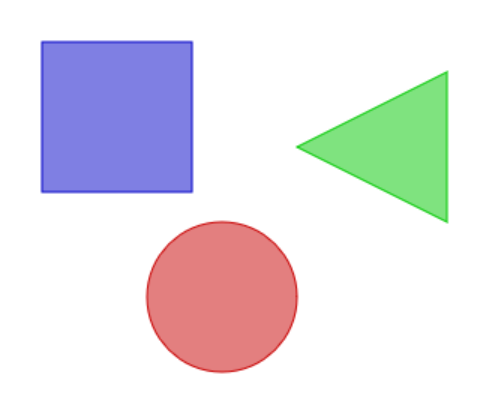

## グラフィックを使ってみる
---
## canvasで図形を描く

HTMLの要素に`canvas`の一行を追加するだけで、JavaScriptでブラウザ画面にグラフィック（絵や写真）を描くことができます。
最初の書き方と座標の指定のやり方が分かれば、結構簡単に描けます。
簡単な図研を描いてみます。



ex_canvas_01.html
```html
<!DOCTYPE html>
<html lang="jp">
<head>
  <title>Canvas Draw</title>
  <meta charset="UTF-8"/>
  <script type="application/javascript" src="ex_canvas_01.js"></script>
  <style type="text/css">
    html, body {
      margin: 0;
      padding: 0;
    }
    </style>
</head>

<!-- 画面がロードされたらdraw()を実行 -->
<body onload="draw();">
  <!-- キャンバス要素とサイズ（幅,高さ） -->
  <canvas id="canvas" width="500" height="300"></canvas>
</body>
</html>
```
ex_canvas_01.js
```javascript
function draw() {
   //canvasへの参照を取得
  var canvas = document.getElementById("canvas");
   //ブラウザが対応しているかの確認
  if (canvas.getContext) {
    //描画コンテキストを取得
    var ctx = canvas.getContext("2d");

    //四角形（塗りつぶし）
    ctx.fillStyle = "rgba(0, 0, 200, 0.5)"; //色  
    ctx.fillRect (30, 30, 100, 100);        //X座標,Y座標,幅,高さ
     //四角形（外枠）
    ctx.strokeStyle = "rgba(0, 0, 200)";
    ctx.strokeRect (30, 30, 100, 100);

    //三角形のパスを描く
    ctx.beginPath();      //パスを作成　
    ctx.moveTo(200,100);  //１番目の点
    ctx.lineTo(300,50);   //２点目の点
    ctx.lineTo(300,150);  //３点目の点
    ctx.closePath();      //パスを閉じる

    //三角形の線と塗りつぶし
    ctx.fillStyle = "rgba(0, 200, 0, 0.5)";
    ctx.fill();           //塗りつぶし
    ctx.strokeStyle = "rgba(0, 200, 0)";
    ctx.stroke();         //輪郭を描く


    //円を描く
    ctx.beginPath();      //パスを作成
    ctx.arc(150, 200, 50, (Math.PI/180)*0, (Math.PI/180)*360, false);//円のパス

    //円の線と塗りつぶし
    ctx.fillStyle = "rgba(200, 0, 0, 0.5)";
    ctx.fill();           //塗りつぶし
    ctx.strokeStyle = "rgba(200, 0, 0)";
    ctx.stroke();         //輪郭を描く
  }
}
```
- [ブラウザで表示](../sample/ex_canvas_01.html)
- [MDN > canvas](https://developer.mozilla.org/ja/docs/Web/API/Canvas_API/Tutorial)

---
[Topに戻る](../)
