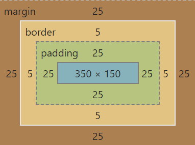

## CSSでレイアウトしてみる
---
### ボックスモデル
ボックスモデルは、HTMLの各要素に余白や境界線を指定するときに、
目安となるものです。
属性となるマージンとパディングの値は、一括または個別で指定できます。

要素とマージン、ボーダー、パディングの関係は、下のようになります。
（ブラウザで確認できます）



例として、文章を含むdiv要素に、各属性を適用してみます。
背景色の水色が`padding`までと境界線の`border`が青で表示されています。
`margin`は背景色は付かず、周りの要素との余白となります。

ex_css_boxmodel.html
```html
<!DOCTYPE html>
<html lang="ja">
<head>
  <meta charset="utf-8">
  <title>CSS Box Model</title>
  <style>
    .box {
      /* ボックスサイズの指定 */
      width: 350px;   /* 中身の幅 */
      height: 160px;  /* 中身の高さ */
      margin: 25px;   /* マージン（外側余白） */
      padding: 25px;  /* パディング （内側余白）*/
      border: 5px solid rgb(0, 117, 146);   /* 境界線の太さ,線種,色 */

      background-color: azure;  /* 背景色 */
    }
  </style>
</head>
<body>
  <!-- classセレクタで指定 -->
  <div class="box">
    <h3>キュゥべえ</h3>
    <p><em>キュゥべえ</em>とは、アニメ『魔法少女まどか☆マギカ』に登場するキャラクターである。
      少女の願い事をひとつだけ叶えてくれる魔法の使者。（公式サイトより） </p>
  </div>
</body>
</html>
```

- [実際の表示](/sample/ex_css_boxmodel.html)
- [MDN > CSS > ボックスモデル](https://developer.mozilla.org/ja/docs/Learn/CSS/Building_blocks/The_box_model) 