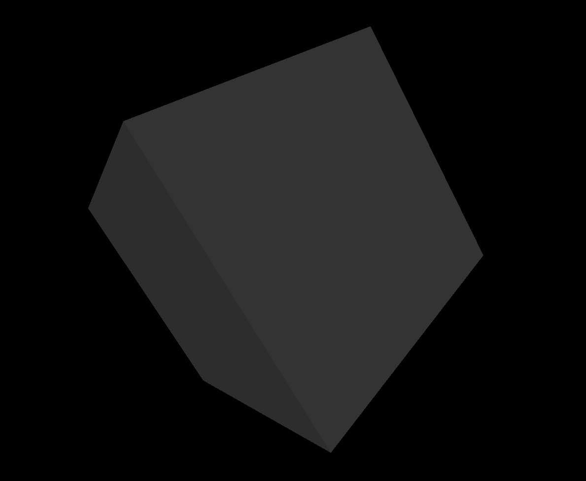

## キューブをぐるぐる回す
---

HTML5では、`canvas`を使って2Dのほかに３Dも表示させることができ、ライブラリー（専用のJavaScriptプログラム）を使うと結構高度なことができたりします。

Webで3Dを扱うためにWebGLという技術が使われていて、今回WebGL用ライブラリのThree.jsを使ってキューブ（立方体）が回転するアニメをやってみます。（ほぼサンプルのままだったりしますが・・。）写真の下のサンプルから表示できると思います。


[サンプルを表示](../sample/ex_three.html)

3Dグラフィックを扱うときは、カメラとかライト、シーンといった言葉が出てくるので、映画を作っているような感じがします。
JavaScriptのプログラムの流れは、大きく次のようになります。

### プログラムの流れ
1.Three.jsをインポート
2.シーン、カメラ、ライトを作成
3.ジオメトリ（キューブの形状）、マテリアル（色など）、メッシュ（ジオメトリにマテリアルを適用したもの）を作成
4.アニメ処理（フレーム毎にキューブの回転、レンダリング）


サンプルのプログラムを下の方に載せますので、設定を色々変えてやってみるといいと思います。Three.jsについて詳しく知りたいときは、以下のサイトを参考にしてください。

- [Three.js](https://threejs.org/docs/index.html#manual/ja/introduction/Creating-a-scene)・・・Three.jsの本家。サンプルも色々あって面白いです。
- [Three.jsの基礎](https://threejsfundamentals.org/threejs/lessons/ja/)・・・フラミンゴがいっぱい飛んでます。詳しい解説があります。
- [ICS.media](https://ics.media/tutorial-three/)・・・Three.jsとWeb技術の記事などがあります。

ex_three.html
```html
<!DOCTYPE html>
<html lang="ja">
<head>
  <meta charset="UTF-8">
  <title>Three.js sample</title>
  <style>
    body { margin: 0; }
  </style>
</head>
<body>
  <script type="module" src="ex_three.js"></script> 
</body>
</html>
```
ex_three.js
```javascript
import * as THREE from 'https://cdn.skypack.dev/three';

// シーンを作成
const scene = new THREE.Scene();
// ライトを作成
{
  const color = 0xFFFFFF;
  const intensity = 1;
  const light = new THREE.DirectionalLight(color, intensity);
  light.position.set(1, -3, 3);
  scene.add(light);
}
// カメラを作成(fov, aspect, near, far)
const camera = new THREE.PerspectiveCamera( 75, window.innerWidth / window.innerHeight, 0.1, 1000 );
// カメラ位置を設定
camera.position.z = 1.6;

// レンダラを作成
const renderer = new THREE.WebGLRenderer();
// レンダリングサイズを設定
renderer.setSize( window.innerWidth, window.innerHeight );
// レンダラ要素をHTMLドキュメントに追加
document.body.appendChild( renderer.domElement );

// ジオメトリを作成
const geometry = new THREE.BoxGeometry();
// マテリアルを作成
const material = new THREE.MeshPhongMaterial({color: 0x555555});  // greenish blue
// メッシュを作成（ジオメトリ、マテリアル）
const cube = new THREE.Mesh( geometry, material );
// メッシュをシーンに追加
scene.add( cube );

// アニメーションの処理
const animate = function () {
  requestAnimationFrame( animate );

  // キューブをフレーム更新毎に回転させる
  cube.rotation.x += 0.008;
  cube.rotation.y += 0.008;
  cube.rotation.z += 0.008;

  // レンダリング（シーン、カメラ）
  renderer.render( scene, camera );
}

// アニメーションを実行
animate();
```
おまけ：Three.jsサイトにある作品
- [Littlest Tokyo](https://threejs.org/examples/#webgl_animation_keyframes)
- [MMD](https://threejs.org/examples/#webgl_loader_mmd_audio)

---
[Topに戻る](../index.html)